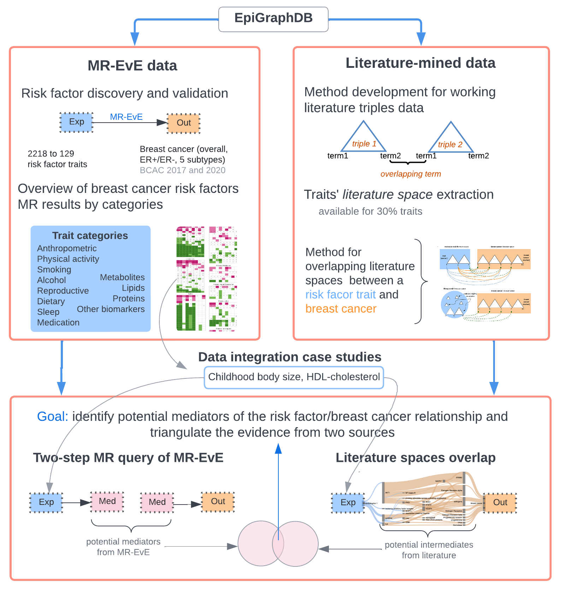

## Breast cancer exploration in EpiGraphDB

This is a development repo of the work presented in the article _"Integrating Mendelian randomization and literature-mined evidence for breast cancer risk factors"_.


* Pre-print on MedRxiv: [https://www.medrxiv.org/content/10.1101/2022.07.19.22277795v1](https://www.medrxiv.org/content/10.1101/2022.07.19.22277795v1) 

* See [Github Pages](https://mvab.github.io/epigraphdb-breast-cancer/) site with links to web-based components of this article.

* [Poster](https://github.com/mvab/epigraphdb-breast-cancer/wiki/MR-conference-2021-poster) about this work that was presented at Mendelian Randomization Conference 2021. 
* [Poster](https://github.com/mvab/epigraphdb-breast-cancer/wiki/IGES-conference-2022-poster) based on the pre-print presented at International Genetic Epidemiology Society meeting 2022 (Paris).


---

### Repo summary

```
├── README.md
├── project_code/
│   ├── 01_MR_related/
│   │   ├── MR_codebase_summary.md # see this file for MR-related analysis documentation
│   │   ├── results/
│   │   └── scripts/
│   ├── 02_literature_related/
│   │   ├── Literature_codebase_summary.md # see this file for literature analysis documentation
│   │   ├── results/
│   │   └── scripts/
├── graph_testing_legacy # python-based initial exploration of EpiGraphDB (not a part of the article results)
├── MRconf_poster.png
├── study_overview.png
└── query_results/

```

### Project overview 

