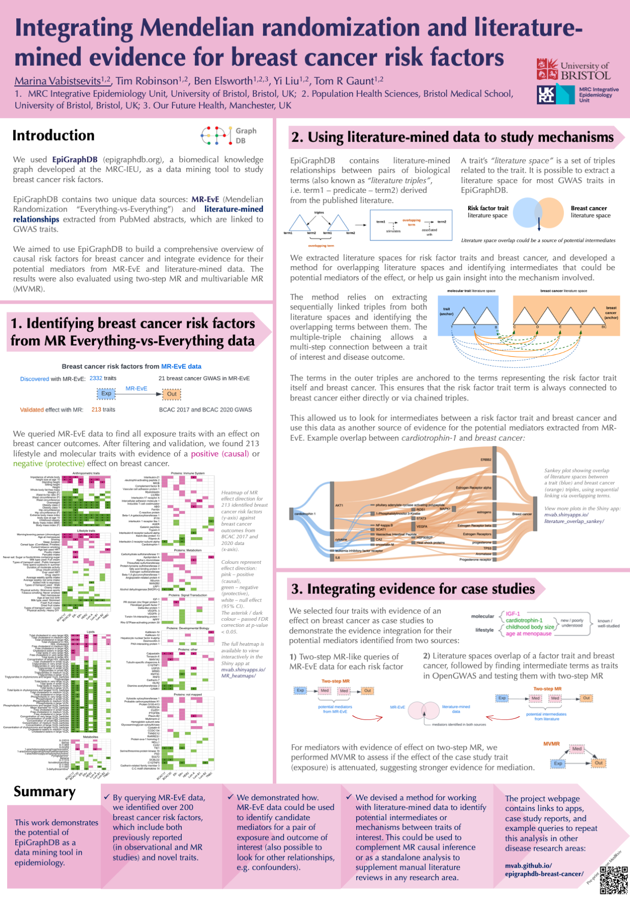

###  Integrating Mendelian randomization

#### R/Shiny apps

* [MR-EvE app](https://mvab.shinyapps.io/brca-miner/)

  The breast cancer MR-EvE (Mendelian Randomization "Everything-vs-Everything") app was created to facilitate the exploration of exposures that could be breast cancer risk or protective factors. The app includes 905 exposure traits split into 12 categories, with MR results available for multiple breast cancer outcome GWAS.
  
  

* [Heatmaps app](https://mvab.shinyapps.io/MR_heatmaps/)

   The MR effect direction heatmap app includes the results for 309 traits that were selected with filtering steps from the initial MR-EvE exploration dataset. 213 traits (or 105 after FDR correction) have evidence of an effect on at least one validation breast cancer outcome. 

  

* [Literature overlap Sankey plot app](https://mvab.shinyapps.io/literature_overlap_sankey/)

  The Sankey plot app provides a visualisation of literature spaces overlap of risk factor traits (case studies only) and breast cancer. 

  

 

#### Case study reports

  
  
  In the article, we explore four breast cancer risk/protective factors in more detail as case studies. The potential mediators identified for these traits from MR-EvE and literature-mined data are investigated in individual reports, which were generated with Rmd.

* [Cardiotrophin-1](content/case_study_report_Cardiotrophin-1.html)

* [IGF-1](content/case_study_report_IGF-1.html)

* [Childhood body size](content/case_study_report_Childhood_body_size.html)

* [Age at menopause](content/case_study_report_Age_at_menopause.html)

 

#### EpiGraphDB queries examples 

GitHub repo [https://github.com/mvab/epigraphdb_mr_literature_queries](https://github.com/mvab/epigraphdb_mr_literature_queries) provides basic examples of querying MR-EvE and literature data in EpiGraphDB. These examples may be helpful for understanding and/or replicating EpiGraphDB queries that were used in this article, or applying them to study your disease of interest.

#### Poster (IGES 2022 conference)

See the full version [here](https://github.com/mvab/epigraphdb-breast-cancer/wiki/IGES-conference-2022-poster)

